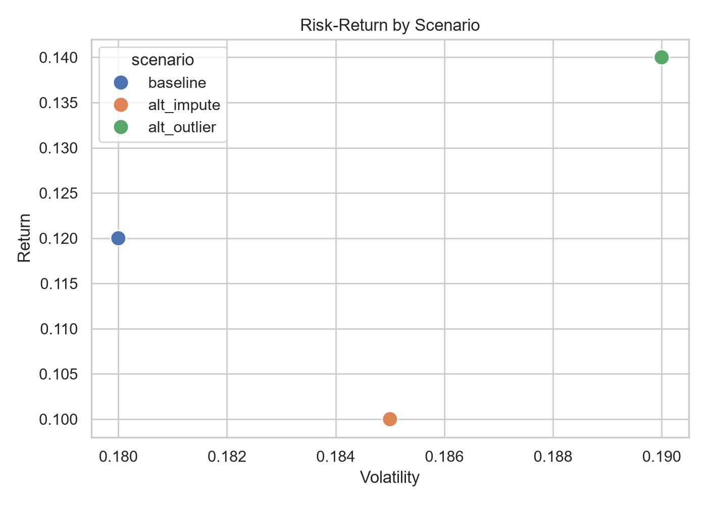
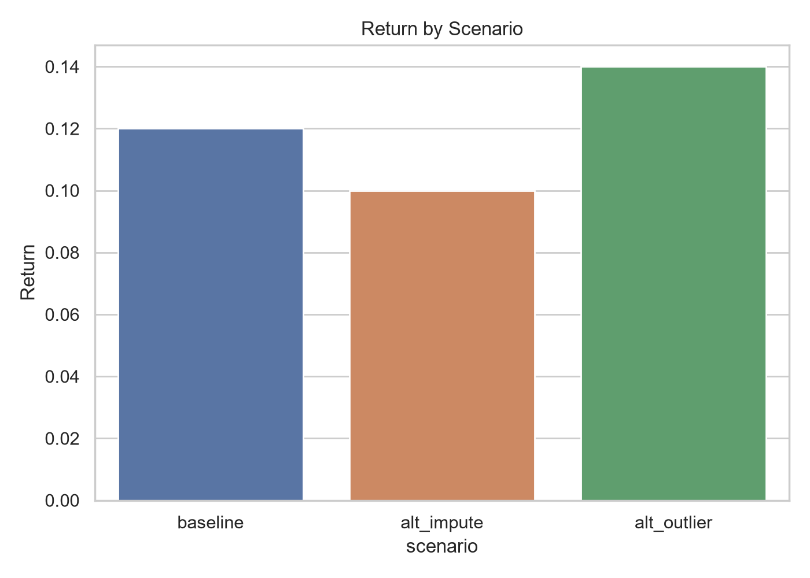
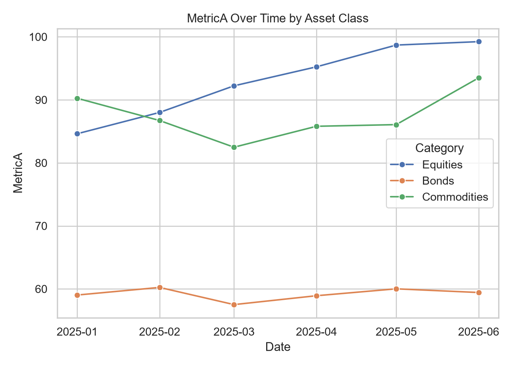

# Portfolio Scenario Analysis: Results Report

## Executive Summary

- The baseline portfolio construction returns 12% at 18% volatility (Sharpe 0.56).
- Switching how missing data gets filled (median to mean) costs 2 points of return and drops
  the Sharpe ratio from 0.56 to 0.43, the single biggest swing of any assumption tested here.
- Asset-class behavior over the period diverges sharply: equities trend up, bonds stay flat,
  commodities trend down, so the portfolio's return depends on rebalancing across all three,
  not on any one holding.

## Charts

### Risk-Return by Scenario

Three points, one per scenario, on the same risk/return axes. The alternate-outlier scenario
sits furthest up and to the right: highest return (14%) but also the highest volatility (19%).
The alternate-imputation scenario is the only one that's both lower-return and worse-Sharpe than
baseline, it isn't compensated for its similar volatility.

Assumption behind this chart: all three scenarios are evaluated over the same historical
window, so the comparison isolates the effect of the assumption change itself, not a change in
what period was tested.

### Return by Scenario

The same return numbers as a bar chart, easier to read at a glance than the scatter above for
anyone who just wants "which scenario returns more." Alt-outlier (14%) > baseline (12%) >
alt-impute (10%).

### MetricA Over Time by Asset Class

Six months of a representative metric for three asset classes. Equities climb, bonds are
roughly flat, commodities decline, three different directions from three different starting
points. Limitation: six months is a short window to call any of these a durable trend rather
than noise.

## Assumptions and Risks

- **Missing-data handling matters more than it might look.** Two reasonable choices, filling
  gaps with the median versus the mean, produce a 2-point return swing and move the Sharpe
  ratio by 0.13. Neither choice is obviously wrong, which is exactly the risk: the "right"
  answer here is a judgment call, not a fact, and a different modeler could reasonably land
  on either one.
- **The outlier rule tested here (3-sigma clipping) is the best-looking scenario, which is a
  reason for caution, not celebration.** Clipping outliers can flatter a return figure by
  removing exactly the extreme losses a stakeholder most needs to see.
- **Six months of asset-class data is a short evaluation window.** The diverging trends in the
  third chart could easily reverse with more history.

## Sensitivity Analysis Summary

| Scenario | Assumption changed | New value | Return | Δ return vs baseline |
|---|---|---|---|---|
| alt_impute | Missing-value fill | mean instead of median | 10% | -2 pts |
| alt_outlier | Outlier handling | 3-sigma clip instead of none | 14% | +2 pts |

Baseline return is 12%. The two alternate assumptions move it by the same 2 points in opposite
directions, so the range a stakeholder should actually expect, given reasonable uncertainty in
these two choices alone, is closer to 10-14% than to a single point estimate of 12%.

## Decision Implications

**What this means for you:** treat 12% as the center of a range, not a fixed number. If a
decision depends on the return being above some threshold between 10% and 14%, that decision is
assumption-sensitive and shouldn't be made on the baseline figure alone. Before committing to
this range, the outlier-clipping choice specifically needs a second look, since it's both the
most flattering result and the one most likely to be hiding tail risk. Next step: rerun the
alt-outlier scenario without clipping the largest losses, and report that number alongside this
one rather than in place of it.
