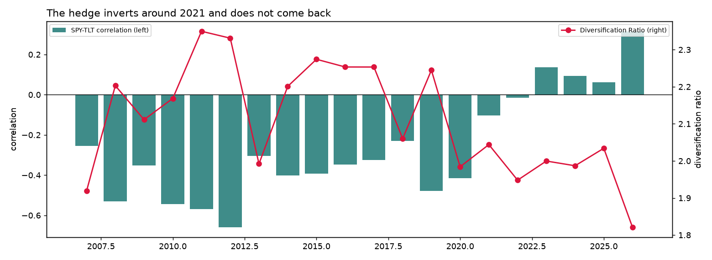
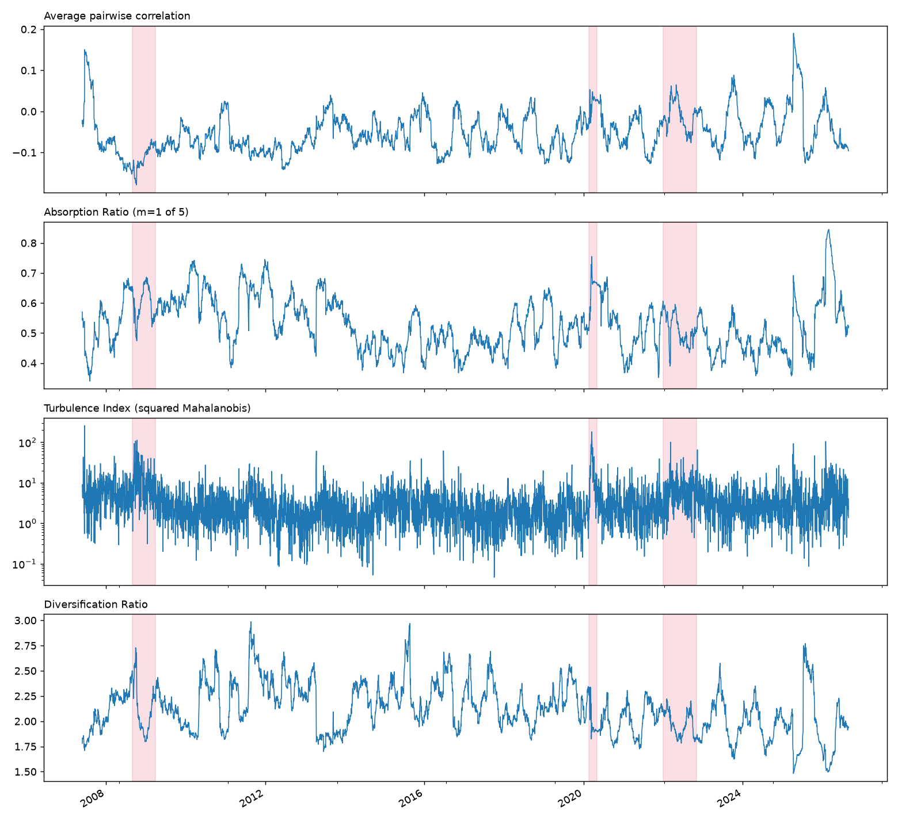

# Cross-Asset Diversification Breakdown Monitor

**Risk memo. Prepared for a multi-asset portfolio manager or head of risk.**
Data through 27 August 2026. Five-ETF basket: `SPY`, `TLT`, `GLD`, `DBC`, `UUP`.

## Executive Summary

- **The stock-bond hedge inverted in 2021 and has not recovered.** The 60-day
  `SPY`-`TLT` correlation averaged -0.427 across 2008 to 2020 and +0.082 across 2021 to
  2026. A book sized on the older number is carrying materially more risk than its
  correlation matrix implies.
- **The break is real, not a volatility artifact.** Variance in the 2022 window ran
  13.2 times the calm 2017 baseline, which is exactly the condition under which
  correlation rises mechanically without any change in the underlying relationship.
  After the Forbes-Rigobon adjustment removes that effect, 94.9% of the correlation move
  survives.
- **The monitor was silent through 2008 and March 2020, and that is the correct
  behaviour, not a miss.** In both of those crises the hedge worked better than usual.
  The events this basket is exposed to and the events conventionally labelled crises are
  not the same set, which is the single most important thing in this memo.

## What the monitor measures

Every trading day it estimates the correlation matrix of the five assets over a trailing
60 days, compresses it into stress measures, and tests whether the reading has moved far
enough from its historical baseline to be called a real change rather than sampling
noise. Flags are corrected for the fact that the same test runs every day on overlapping
windows, which would otherwise generate false alarms from repetition alone.

The measure that carries the most weight for a portfolio holder is the Diversification
Ratio: the volatility the basket would have if everything moved together, divided by the
volatility it actually has. It is the factor by which diversification is shrinking risk.
A value of 1.0 means none at all.

## Finding 1: the hedge inverted, and it stayed inverted

| Era | `SPY`-`TLT` correlation | Diversification Ratio | Flagged days per year |
| --- | --- | --- | --- |
| 2008 to 2020 | -0.427 | 2.187 | 0.7 |
| 2021 to 2026 | +0.082 | 1.972 | 80.5 |

The transition is not a spike. Annual means run -0.415 (2020), -0.103 (2021), -0.015
(2022), +0.137 (2023), +0.093 (2024), +0.062 (2025), +0.315 (2026). The longest unbroken
run of positive correlation is 266 days across 2023 and 2024, with a second run of 160
days still open at the end of the sample.

**What this means for you.** Bonds are no longer reliably offsetting equity drawdowns.
The diversification benefit fell by roughly 10% between the two eras, and the correlation
that produced the benefit has changed sign rather than merely weakened. A 60/40 or
risk-parity allocation calibrated on pre-2021 data is understating its own tail risk.

## Finding 2: the move survives the volatility check

The obvious competing explanation for any correlation change during a stressed period is
that nothing about the relationship changed and only volatility rose. Correlation is
covariance over the product of standard deviations, and a shock passing through both
series inflates the numerator faster than the denominator, so a correlation estimate
rises on its own.

| Quantity | Value |
| --- | --- |
| `SPY`-`TLT` correlation, calm 2017 window | -0.334 |
| `SPY`-`TLT` correlation, 2022 window, raw | +0.025 |
| Same, adjusted to 2017 volatility | +0.007 |
| Variance ratio, 2022 over 2017 | 13.2x |
| Share of the move attributable to volatility | 5.1% |

Despite a thirteen-fold increase in variance, only about one twentieth of the correlation
change is a volatility artifact. The rest is a genuine change in how the two assets
relate to each other.

**What this means for you.** This is not a reading that will revert when volatility
normalises. It should be treated as a change in the correlation structure itself.

## Finding 3: the monitor is silent through 2008 and 2020, on purpose

Graded against the three crisis windows this project originally set out to detect, the
monitor performs poorly: precision 0.042, recall 0.052, F1 0.046, with a block-bootstrap
95% interval on F1 of [0.000, 0.136] that includes zero.

That number is real and is not being hidden, but it is measuring the wrong thing. In the
2008 window the `SPY`-`TLT` correlation ran to -0.535 against a full-sample -0.277, and
in March 2020 it ran to -0.522. In both cases the hedge was working roughly twice as well
as normal. The basket holds flight-to-quality assets deliberately, and in a flight to
quality those assets rally while equities fall, which drives the correlation more
negative. The monitor stays quiet because there was no diversification breakdown to
detect.

The same logic explains the exposure backtest. Cutting the position to half on flagged
days avoids none of the buy-and-hold drawdown, because the deepest drawdown in `SPY` is
2008 to 2009 and the monitor is correctly silent then. It costs roughly 21 percentage
points of cumulative return over the sample and buys no protection, on this labelling.

**What this means for you.** Do not use this monitor as a general crisis detector. It
detects one specific failure, the loss of the diversifying relationship between holdings,
and that failure is not what happened in 2008 or March 2020.

## Assumptions and risks

**The statistical calibration is measured, not assumed, and this matters.** The textbook
standard error for a correlation estimate assumes returns inside the window are
independent and normal. Real returns are neither, and the realised standard deviation of
the transformed correlation is about twice the theoretical value on this data. Left
uncorrected, a nominal 5% test would fire about 30% of the time. The correction is
calibrated on 2007 to 2015 and applied out of sample.

**The regime model is close to a threshold rule.** The two-state Hidden Markov Model
agrees with a simple two-threshold rule on 98% of days. Its genuine contribution is
stability of the label, 26 regime switches against 81 for a single fixed threshold, not
the discovery of structure a simpler method would miss.

**The regime model is unstable to refitting.** Fitted on an expanding window and decoded
forward only, about 22% of days receive a different label than the full-sample fit gives
them. The historical regime chart should be read as a description of the past, not as
what the monitor would have said at the time.

**Three labelled events is a thin sample.** Any claim about detection skill rests on very
few independent episodes, and two of the three turn out not to be instances of the
phenomenon at all.

**The proxies are not the asset classes.** `GLD` is a claim on gold rather than gold, and
each ETF can diverge from what it stands for during exactly the stress the monitor exists
to catch.

## Sensitivity

| Scenario | Change from baseline | Effect |
| --- | --- | --- |
| Baseline: 60-day window, quarterly families, one-sided, alpha 0.01 | 502 flagged days of 4,845 | first sustained flag mid-2021 |
| Two-sided test | flags concentrate in 2008 and 2012 | inverts the result; flags the calm, well-hedged years |
| No variance correction | roughly a quarter of all days flag before correction | signal becomes meaningless |
| Full-sample baseline instead of 2007 to 2015 | threshold partly set by the episodes being detected | circular, inflates apparent skill |

The variance correction and the one-sided alternative are the two choices the result
depends on most. Neither is a tuning parameter chosen to improve the answer; both were
adopted because the uncorrected version demonstrably mis-fires, and the measurements
behind each are printed in the pipeline notebook.

## Decision implications

**Re-estimate the correlation matrix your sizing depends on, using post-2021 data only.**
The 2008 to 2020 average is not a description of the current regime and has not been for
five years.

**Treat bonds as a return asset rather than a hedge until the correlation turns
negative again.** Whatever diversification the book currently has is not coming from the
equity-bond pair.

**Use this monitor for what it measures.** It answers whether the diversifying
relationships between holdings are intact. It does not answer whether a drawdown is
coming, and the two questions came apart in 2008 and 2020.

**Next step if this is to be relied on operationally.** Extend the same testing procedure
to all ten asset pairs rather than the equity-bond pair alone, so a breakdown elsewhere in
the basket is caught with the same statistical discipline. The machinery is already
pair-agnostic; only the reporting layer assumes a single pair.

## Reproducing this

Every figure and number above comes from `notebooks/project_pipeline.ipynb`, which runs
top to bottom against live data. See `README.md` for setup and `docs/methodology_notes.md`
for the calibration decisions and the places where the data disagreed with the project's
original framing.
